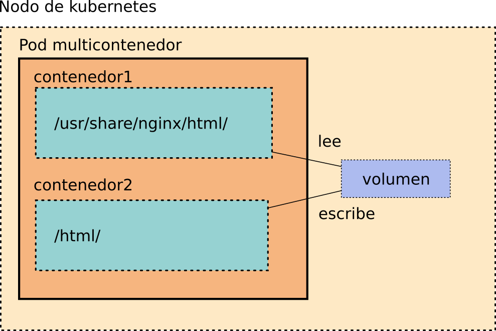

# ACTIVIDAD Nº 2

## TÍTULO DE LA ACTIVIDAD: Trabajando con un pod multicontenedor

## TEXTO DE LA ACTIVIDAD

En esta tarea vamos a profundizar en los pods multicontenedor. Como indicamos en el contenido del módulo, un pod puede estar formado por varios contenedores y por volúmenes (para permitir que los contenedores del pod puedan compartir almacenamiento). 

* **Nota 1: Estudiaremos más en profundidad los volúmenes en un módulo posterior.** 
* **Nota 2: Veremos también que los pods son efímeros, es decir, que se pierde la información cuando el pod se elimina.**

La razón principal por la que los Pods pueden tener múltiples contenedores es para admitir aplicaciones auxiliares que ayudan a una aplicación primaria. Ejemplos típicos de estas aplicaciones pueden ser las que envían o recogen datos externos (por ejemplo de un repositorio) y los servidores proxy. El ayudante y las aplicaciones primarias a menudo necesitan comunicarse entre sí. Normalmente, esto se realiza a través de un sistema de archivos compartido o mediante la interfaz de red de bucle de retorno, localhost.

Veamos dos ejemplos concretos:

1. Un servidor web junto con un programa auxiliar que sondea un repositorio Git en busca de nuevas actualizaciones.
2. Un  servidor  web con un servidor de aplicaciones PHP-FPM, lo podemos implementar  en un pod, y cada servicio en un contenedor. Además tendría un volumen interno que se montaría en el *DocumentRoot* para que el servidor web y el servidor de aplicaciones puedan acceder a la aplicación.

Veamos un pequeño ejemplo de un pod multicontenedor:

Tenemos la definición del pod en el fichero [`pod_multicontenedor.yaml`](files/pod_multicontenedor.yaml):

```yaml
apiVersion: v1
kind: Pod
metadata:
  name: pod_multicontenedor
spec:
  volumes:
  - name: html
    emptyDir: {}
  containers:
  - name: contenedor1
    image: nginx
    volumeMounts:
    - name: html
      mountPath: /usr/share/nginx/html
  - name: contenedor2
    image: debian
    volumeMounts:
    - name: html
      mountPath: /html
    command: ["/bin/sh", "-c"]
    args:
      - while true; do
          date >> /html/index.html;
          sleep 1;
        done
```

Estudiemos la definición del pod:



* El pod se llama `pod_multicontenedor` y en el apartado `spec` vemos que está formado por un volumen (llamado `html` y de tipo `emptyDir`, que estudiaremos más adelante, pero que básicamente es un directorio que vamos a montar en los contenedores) y dos contenedores (llamados `contenedor1` y `contenedor2`).
* El `contenedor1` se crea a partir de la imagen `nginx`, es el contenedor principal, encargado de servir la web. En este contenedor montamos el volumen `html` en su *DocumentRoot* (`/usr/share/nginx/html`). Va a servir el fichero `index.html` que está modificando el otro contenedor.
* El `contenedor2` es el auxiliar. En este caso se monta el volumen `html` en el directorio `html` donde va modificando el fichero `index.html` con la fecha y hora actuales cada un segundo (parámetro `command` y `args`). 
* Como los dos contenedores tienen montado el volumen, el fichero `index.html` que va modificando el `contenedor2`, es el fichero que sirve el `contenedor1`.

Para realizar la actividad realiza los siguientes pasos:

1. Crea el pod.
2. Muestra información del pod, y fíjate que el pod está formado por un volumen y dos contenedores.
3. Vamos a ver el contenido del fichero `index.html` en el primer contenedor, ejecutando:

        kubectl exec pod_multicontenedor -c contenedor1 -- /bin/cat /usr/share/nginx/html/index.html

    En esta ocasión hay que indicar el contenedor (opción `-c`) para indicar donde vamos a ejecutar la instrucción.
4. Vamos a ver el contenido del fichero `index.html` en el segundo contenedor, ejecutando:

        kubectl exec pod_multicontenedor -c contenedor2 -- /bin/cat /html/index.html
5. Ejecuta un "port forward" para acceder al pod en el puerto 8081 de localhost, sabiendo que el servicio usa el puerto 80.
6. Accede desde un navegador para ver el resultado. Refresca la página para observar cómo va cambiando el fichero `index.html`.

Para superar la actividad deberás entregar en un fichero comprimido el siguiente pantallazo:

1. Un pantallazo donde se vea el acceso a la página desde un navegador web.

## RECURSOS

* Conexión a internet
* El fichero con la definición del pod: [`files/pod_multicontenedor.yaml`](pod_multicontenedor.yaml)

## ¿ES OBLIGATORIO HACER ESTA ACTIVIDAD PARA SUPERAR EL CURSO? (S/N)

No

## ¿ES UNA ACTIVIDAD INDIVIDUAL O DE GRUPO?

Individual

## ¿ES UNA ACTIVIDAD CALIFICABLE?

Si

### ¿Tiene que ser calificada por el tutor/a? (S/N) 

Si

### ¿Es de calificación automática?

No

### ¿Es calificada por el resto de compañeros/as del curso? (S/N)

No

## EVALUACIÓN

* Se entregan los documentos; contienen lo solicitado y los contenidos son originales.

## ¿ES NECESARIO TENER TERMINADA ALGUNA ACTIVIDAD O RECURSO ANTERIOR? Indique cuáles.

No

## TIEMPO ESTIMADO PARA REALIZAR LA ACTIVIDAD

1 hora