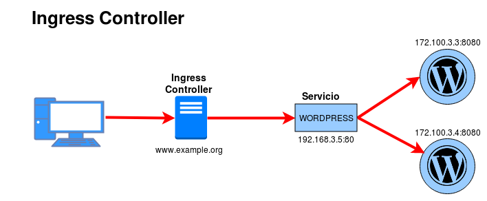

# Ingress Controller

Hasta ahora tenemos dos opciones principales para acceder a nuestras aplicaciones desde el exterior:

1. Utilizando servicios del tipo NodePort: Esta opción no es muy viable para entornos de producción ya que tenemos que utilizar puertos aleatorios desde 30000-40000.
2. Utilizando servicios del tipo LoadBalancer: Esta opción sólo es válida si trabajamos en un proveedor Cloud que nos ofrece un balanceador de carga para cada una de las aplicaciones, en cloud público puede ser una opción muy cara.

La solución puede ser utilizar un [Ingress controller](https://kubernetes.io/docs/concepts/services-networking/ingress/) que nos permite utilizar un proxy inverso (HAproxy, nginx, traefik,...) que por medio de reglas de encaminamiento que obtiene de la API de Kubernetes, nos permite el acceso a nuestras aplicaciones por medio de nombres.



## Instalación de Ingress Controller en miinikube

Cuando hacemos una instalación de minikube el componente de Ingress Controller no viene instalada por defecto. minikube nos ofrece un conjunto de *addons* que al activarlos nos instalan un determinado componente que nos ofrece una funcionalidad adicional. Para ver los *addons* que nos ofrece minikube podemos ejecutar:

    minikube addons list

Para activar el ingress controller ejecutamos:

    minikube addons enable ingress

Para comprobar si tenemos instalado el componente, podemos visualizar los pods creados en el *namespace* `kube-system`. En este espacio de nombre encontramos distintos despliegues con componentes del propio cluster de Kubernetes. Por lo tanto al ejecutar:

    kubectl get pods -n kube-system 
    ...
    ingress-nginx-controller-558664778f-shjzp   1/1     Running     0          
    ...    

Debe aparece un pod que se llama `ingress-nginx-controller-...`, si es así, significa que se ha instalado un ingress controller basado en el proxy inverso nginx.

## Describiendo el recurso Ingress

Una vez instalado el componente ingress controller, ya podemos definir un recurso Ingress en un fichero yaml. Para ello vamos a trabajar con el despliegue y el servicio que hemos creado de nginx.

El recurso ingress para acceder a nuestro despliegue de nginx lo tenemos en ele fichero [`ingress.yaml`](file/ingress.yaml):

```yaml
apiVersion: networking.k8s.io/v1
kind: Ingress
metadata:
  name: nginx
spec:
  rules:
  - host: www.example.org
    http:
      paths:
      - path: /
        pathType: Prefix
        backend:
          service:
            name: nginx
            port:
              number: 80
```

Hemos indicado el tipo de recurso Ingress (`kind`) y le hemos puesto un nombre (`name`). A continuación en la especificación del recurso vamos a poner una regla que relaciona un nombre de host con un service que me permita el acceso a una aplicación:

* `host`: Indicamos el nombre de host que vamos a usar para el acceso. Este nombre debe apuntar a la ip del nodo master.
* `path`: Indicamos el path de la url que vamos a usar, en este caso sería la ruta raíz: `/`. Esto nos sirve por si queremos servir la aplicación en una ruta determinada, por ejemplo: `www.example.org/app1`.
* `pathType`: No es importante, nos permite indicar cómo se van a trabajar con las URL. 
* `backend`: Indicamos el servicio al que vamos a acceder. En este caso indicamos el nombre del servicio (`service/name`) y el puerto del servicio (`service/port/number`).

Cuando se crea el recurso, y accedamos al nombre indicado, un proxy inverso redirigirá las peticiones HTTP a la IP y al puerto del servicio correspondiente. **Nota: Utilizando ingress no es necesario que los servicios sean de tipo NodePort para acceder a la aplicación desde el exterior**.

## Gestionando el recurso Ingress

Para crear el recurso ingress:

    kubectl apply -f ingress.yaml

Y podemos ver el recurso ingress que hemos creado:

    kubectl get ingress

Y obtener información detallada del recurso con:

    kubectl describe ingress/nginx

## Accediendo a la aplicación

Como no tenemos un servidor DNS que nos permita gestionar los nombres que vamos a utilizar para el acceso a las aplicaciones, vamos a usar resolución estática. Para ello como `root` añadimos una nueva línea en el fichero `/etc/hosts`, indicando el nombre (`www.example.org`) y la ip a la que corresponde, la ip del nodo master:

    192.168.39.222  www.example.org

Y ya podemos acceder a la aplicación usando el nombre:


