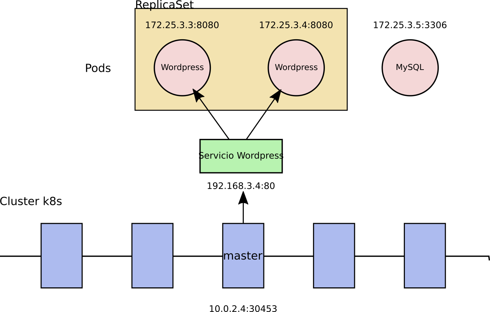

# Services. Tipos de servicios

Los servicios ([services](https://kubernetes.io/docs/concepts/services-networking/service/)) nos permiten acceder a las aplicaciones que hemos desplegado en el cluster.

* Un servicio es una abstracción que **nos permite acceder a un conjunto de pods** (que se han creado a partir de un Deployment) que implementan una aplicación (Por ejemplo: acceder a un servidor web, a una servidor de base de datos, a un microservicio que forma parte de una aplicación, ...).
* A cada Pod se le asigna una IP a la que no se puede acceder directamente, por lo tanto necesitamos un Service que nos ofrece **una dirección virtual (CLUSTER-IP) y un nombre** que identifica al conjunto de Pods que representa, al cual nos podemos conectar.
* La conexión al servicio se puede realizar **desde otros Pods o desde el exterior** (mediante la generación aleatoria de un puerto). Por ejemplo, si tenemos una aplicación formada por dos servicios: servidor web y servidor de base de datos, tendremos que acceder desde el exterior al servidor web, y acceder al servidor de base de datos desde el servidor web. En principio no será necesario acceder al servidor de base de datos desde el exterior.
* Si el Deployment que hemos creado tiene más de un Pod asociado, el servicio que representa el acceso a esta aplicación **balanceará la carga** entre los Pods con una política Round Robin.
* En el cluster existirá un componente que nos ofrece un **servicio DNS**. Cada vez que creamos un Service se actualizará el DNS para resolver el nombre que hemos asignado al servicio con la IP virtual (CLUSTER-IP) que se le ha asignado.
* **Nota** Cuando tenemos más de un Pod ofreciendo el mismo servicio, realmente tenemos un clúster y es importante distinguir entre servicios sin estado (*stateless*) o con estado (*stateful*)). En un servicio sin estado (por ejemplo, un servidor web que sirva contenido estático), las peticiones son independientes y se pueden servir por diferentes nodos sin problema, aunque en el caso de un servidor web, deberíamos asegurarnos previamente de que el directorio con los datos es el mismo. Un servicio de este tipo lo podemos escalar con un despliegue sin problema. Por otra parte, si el servicio tiene estado (por ejemplo, un servidor de bases de datos), una petición puede depender de otra anterior, por lo que puede haber incoherencias si simplemente creamos un cluster de nodos iguales. En este tipo de servicios, es necesaria una configuración adicional que controle el estado y que haga que los datos que sirve cada Pod son coherentes entre sí. Veremos un ejemplo de este tipo de servicios en el módulo 9 del curso.

## Tipos de servicios

### ClusterIP

Solo permite el acceso interno a un servicio de este tipo, es decir si tenemos un despliegue con una aplicación a la que no es necesaria acceder desde el exterior, crearemos un Service de este tipo para que otras aplicaciones puedan acceder a ella (por ejemplo, una base de datos). Es el tipo por defecto. Si deseamos seguir accediendo desde el exterior, para hacer pruebas durante la fase de desarrollo podemos seguir utilizando la instrucción `kubectl port-forward`.

Veamos el ejemplo:

1. Necesitamos que los Pods de Wordpress accedan al Pod del MySQL.
2. La IP que ha tomado el Pod de MySQL (`172.25.3.5`) es inaccesible desde los Pods de wordpress.
3. Por lo tanto hemos creado un Service de tipo ClusterIP, que ha obtenido una ip virtual (`192.168.3.5`) y expone el puerto de MySQL 3306.
4. Esta IP sí es accesible desde los Pods de Wordpress.
5. Al acceder a esta IP se balanceará la carga entre los Pods de MySQL (en el ejemplo sólo tenemos uno).
6. Además en el Wordpress no necesitamos configurar la IP virtual del Service que hemos creado, ya que disponemos de un servidor DNS que resuelve el nombre del servicio `mysql` en la dirección virtual del servicio (`192.168.3.5`). Por lo tanto en la configuración de Wordpress pondremos el nombre `mysql` como host del servidor de base de datos al que debe acceder.

### NodePort

Abre un puerto, para que el servicio sea accesible desde el exterior. Por defecto el puerto generado está en el rango de 30000:40000. Para acceder usamos la ip del servidor master del cluster y el puerto asignado.

Veamos el ejemplo:

1. Necesitamos que los Pods de Wordpress sean accesibles desde el exterior, para que podamos acceder a la aplicación.
2. La IP que han tomado los Pods de Wordpress (`172.25.3.3`, ...) no son accesibles desde el exterior. Además comprobamos que estos Pods están ofreciendo el servicio en el puerto 8080.
3. Por lo tanto, hemos creado un Service de tipo NodePort que ha obtenido una IP virtual (`192.168.3.4`) y expone el puerto 80.
4. Al acceder a esta IP al puerto 80 se balanceará la carga entre los Pods de Wordpress, accediendo a las IPs de los Pods de Wordpress al puerto 8080.
6. El Service NodePort ha asignado un puerto de acceso aleatorio (entre el 30000 - 40000), y que nos permite acceder a la aplicación accediendo a la IP del nodo master. En el ejemplo si accedemos a `10.0.2.4:30453` estaremos accediendo al Service que nos permitirá acceder a la aplicación.

### LoadBalancer

Este tipo sólo está soportado en servicios de cloud público (GKE, AKS o AWS). El proveedor asignará un recurso de balanceo de carga para el acceso a los servicios. Si usamos un cloud privado como OpenStack, necesitaremos un plugin para configurar el funcionamiento. Este tipo de servicio no lo vamos a utilizar en el presente curso.

Como vemos en el ejemplo, el cloud de infraestructura donde tengamos instalado el cluster nos ofrecerá un recurso *balanceador de carga* con una IP accesible desde el exterior que nos permitirá acceder a la aplicación directamente.
