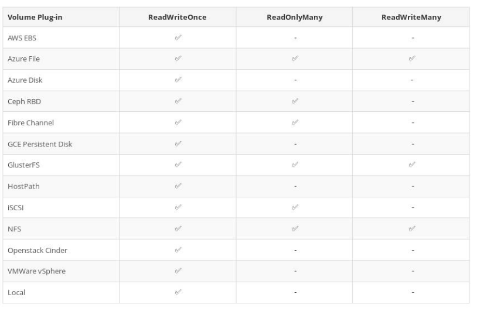

# Aprovisionamiento de volúmenes

Para que el administrador de kubernetes defina los volúmenes disponible en nuestro cluster tenemos dos posibilidades:

## Aprovisionamiento dinámico

Cuando el desarrollador necesita almacenamiento para su aplicación, hace una petición de almacenamiento creando un recurso *PersistantVolumenClaim* y de forma dinámica se crea el recurso *PersistantVolume* que representa el volumen y se asocia con esa petición. DE otra forma explicado, cada vez que se cree un *PersistentVolumenClaim*, se creará bajo demanda un *PersistentVolumen* que se ajuste a las características seleccionadas.

Para obtener la [gestión dinámica de volúmenes](https://kubernetes.io/docs/concepts/storage/dynamic-provisioning/), necesitamos [un "provisionador" de almacenamiento](https://kubernetes.io/docs/concepts/storage/storage-classes/#provisioner) (tendremos distintos provisionadores para los distintos tipos de almacenamiento).

Para definir los "provisionadores" de almacenamiento, usaremos el objeto *StoreClass*, minikube, por defecto ya tenemos un provisionador para almacenamiento del tipo *hostPath* (monta un directorio del host en el pod).

```bash
kubectl get storageclass
NAME             PROVISIONER             AGE
standard (default)   k8s.io/minikube-hostpath   2d23h
```

## Aprovisionamiento estático

En este caso, es el administrador del cluster el responsable de ir definiendo los distintos volúmenes disponibles en el cluster creando manualmente los distintos recursos *PersistentVolumen*.

Un *PersistentVolumen* es un objeto que representa los volúmenes disponibles en el cluster. En él se van a definir los detalles del [backend](https://kubernetes.io/docs/concepts/storage/persistent-volumes/#types-of-persistent-volumes) de almacenamiento que vamos a utilizar, el tamaño disponible, los [modos de acceso](https://kubernetes.io/docs/concepts/storage/persistent-volumes/#access-modes), las [políticas de reciclaje](https://kubernetes.io/docs/concepts/storage/persistent-volumes/#reclaim-policy), etc.

Tenemos tres modos de acceso, que depende del backend que vamos a utilizar: 

* ReadWriteOnce: read-write solo para un nodo (RWO) 
* ReadOnlyMany: read-only para muchos nodos (ROX) 
* ReadWriteMany: read-write para muchos nodos (RWX)

Las políticas de reciclaje de volúmenes también depende del backend y son: 

* Retain: El PV no se elimina, aunque el PVC se elimine. El administrador debe borrar el contenido para la próxima asociación. 
* Recycle: Reutilizar contenido. Se elimina el contenido y el volumen es de nuevo utilizable.
* Delete: Se borra después de su utilización.

Podemos ver un resumen de los backend de almacenamiento:



Por último, vemos un ejemplo de un fichero yaml que nos permite la definición de un *PersitentVolumen*:

```yaml
apiVersion: v1
kind: PersistentVolume
metadata:
  name: pv1
spec:
  storageClassName: manual
  capacity:
    storage: 5Gi
  accessModes:
    - ReadWriteMany
  persistentVolumeReclaimPolicy: Recycle
  hostPath:
    path: /data/pv1
```

* `storageClassName: manual`: Indica que este volumen se puede asignar de forma estática, sin utilizar ningún "provisonador" de almacenamiento.
* Se indica al tamaño del volumen, con `capacity`, `storage`.
* `accessModes`: El modo de acceso.
* `persistentVolumeReclaimPolicy`: La política de reciclaje.
* Y por útimo se indica el tipo (backend) de almacenamiento), es este caso es de tipo `hostPath` que creará un directorio (`/data/pv1`) en el nodo para guardar la información.