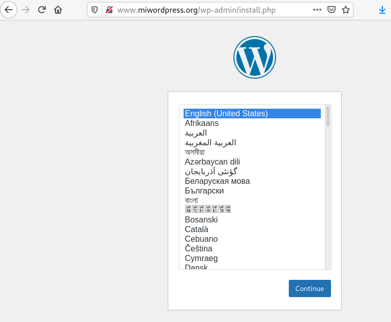

# Ejemplo 3: Wordpress con almacenamiento persistente

En este ejemplo vamos a volver e realizar el [Ejemplo completo: Despliegue y acceso a Wordpress + MariaDB](../modulo7/wordpress.md) del módulo anterior, pero añadiendo el almacenamiento necesario para que la aplicación sea persistente.

Para llevar a cabo esta tarea necesitaremos tener a nuestra disposición dos volúmenes:

* Uno para guardar la información de Wordpress.
* Otro para guardar la información de MariaDB.

Para este ejercicio utilizaremos asignación dinámica de volúmenes.

## Creación de los volúmenes necesarios

Como hemos comentado vamos a usar la asignación dinámica de volúmenes, por lo tanto tendremos que crear dos objetos PersistentVolumenClaim para solicitar los dos volúmenes.

Para solicitar el volumen para la aplicación Wordpress usaremos el fichero [`wordpress-pvc.yaml`](files/wordpress/wordpress-pvc.yaml):

```yaml
apiVersion: v1
kind: PersistentVolumeClaim
metadata:
    name: wordpress-pvc
spec:
  accessModes:
    - ReadWriteOnce
  resources:
    requests:
      storage: 5Gi
```

Y para solicitar el volumen para la base de datos usaremos un fichero similar: [`mariadb-pvc.yaml`](files/mariadb/wordpress-pvc.yaml):

```yaml
apiVersion: v1
kind: PersistentVolumeClaim
metadata:
    name: mariadb-pvc
spec:
  accessModes:
    - ReadWriteOnce
  resources:
    requests:
      storage: 5Gi
```

Creamos las solicitudes y comprobamos que se ha asociado un volumen a cada una de ellas:

```bash
kubectl apply -f wordpress-pvc.yaml
kubectl apply -f mariadb-pvc.yaml

kubectl get pv,pvc
NAME                                                        CAPACITY   ACCESS MODES   RECLAIM POLICY   STATUS   CLAIM                   STORAGECLASS   REASON   AGE
persistentvolume/pvc-01ed3c4c-a542-4161-93a9-b9d5ea2bf6d1   5Gi        RWX            Delete           Bound    default/wordpress-pvc   standard                10s
persistentvolume/pvc-78acc14b-71da-4cf0-861d-0ab7780bca4f   5Gi        RWX            Delete           Bound    default/mariadb-pvc     standard                10s

NAME                                  STATUS   VOLUME                                     CAPACITY   ACCESS MODES   STORAGECLASS   AGE
persistentvolumeclaim/mariadb-pvc     Bound    pvc-78acc14b-71da-4cf0-861d-0ab7780bca4f   5Gi        RWX            standard       10s
persistentvolumeclaim/wordpress-pvc   Bound    pvc-01ed3c4c-a542-4161-93a9-b9d5ea2bf6d1   5Gi        RWX            standard       10s
```

## Modificación de los Deployments para el uso de los volúmenes

A continuación vamos a modificar el fichero [`wordpress-deployment.yaml`](files/wordpress/wordpress-deployment.yaml) para añadir el volumen al Pod y el punto de montaje:

```yaml
...
    spec:
      containers:
      ...
          volumeMounts:
            - name: wordpress-vol
              mountPath: /var/www/html
      volumes:
        - name: wordpress-vol
          persistentVolumeClaim:
            claimName: wordpress-pvc
```
Como observamos vamos a usar el volumen asociado al PersistentVolumenClaim `wordpress-pvc` y que lo vamos a montar en el directorio *DocumentRoot* del servidor web: `/var/www/html`.

De forma similar, modificamos el fichero [`mariadb-deployment.yaml`](files/wordpress/mariadb-deployment.yaml):

```yaml
...
    spec:
      containers:
    ...
          volumeMounts:
            - name: mariadb-vol
              mountPath: /var/lib/mysql
      volumes:
        - name: mariadb-vol
          persistentVolumeClaim:
            claimName: mariadb-pvc

```
En esta ocasión usaremos el volumen asociado a `mariadb-pvc` y el punto de montaje se hará sobre el directorio donde se guarda la información de la base de datos: `/var/lib/mysql`.

Evidentemente, no es necesario modificar la definición de los otros recursos: Services e Ingress.

Creamos el Deployment, los Services y el Ingress:

* [mariadb-srv.yaml](files/wordpress/mariadb-srv.yaml)
* [wordpress-srv.yaml](files/wordpress/wordpress-srv.yaml)
* [wordpress-ingress.yaml](files/wordpress/wordpress-ingress.yaml)

```bash
kubectl apply -f mariadb-deployment.yaml
kubectl apply -f mariadb-srv.yaml
kubectl apply -f wordpress-deployment.yaml
kubectl apply -f wordpress-srv.yaml
kubectl apply -f wordpress-ingress.yaml
```

Acedemos a la aplicación y la configuramos:




## Comprobando la persistencia de la información

Si en cualquier momento tenemos que eliminar o actualizar uno de los despliegues, podemos comprobar que la información sigue existiendo después de volver a crear los Deployments:

```bash
kubectl delete -f mariadb-deployment.yaml
kubectl delete -f wordpress-deployment.yaml
kubectl apply -f mariadb-deployment.yaml
kubectl apply -f wordpress-deployment.yaml
```

Si volvemos acceder, comprobamos que la aplicación sigue funcionando con toda la información:


